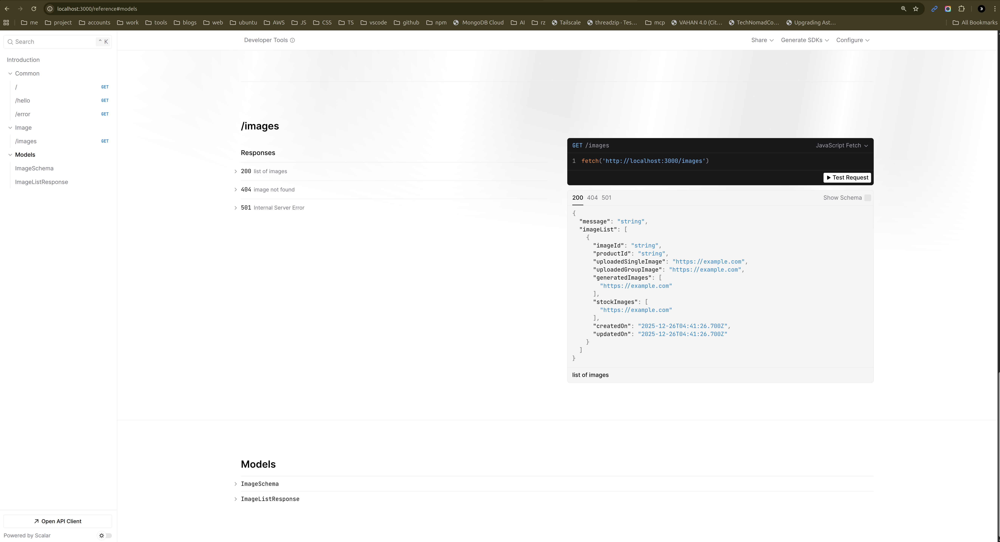

# Hono Server

This is a boilerplate application built with Hono and created for reproduction of the issue 

## Getting Started

### Prerequisites

- Node.js (v20 or later)
- TypeScript

### Installation

1. Navigate to the project directory, _backend_ folder

2. Install dependencies

```bash
npm install
```

### Development

To start the development server, run:

```bash
npm run start
```

we can see all listed API signature on <http://localhost:3000/reference>




### How to Reproduce 

uncomment line # 6 on `src/routes/image/image.index.ts` and restart the server and you will see the error on `/reference` page as below: 

> Document 'api-1' could not be loaded


